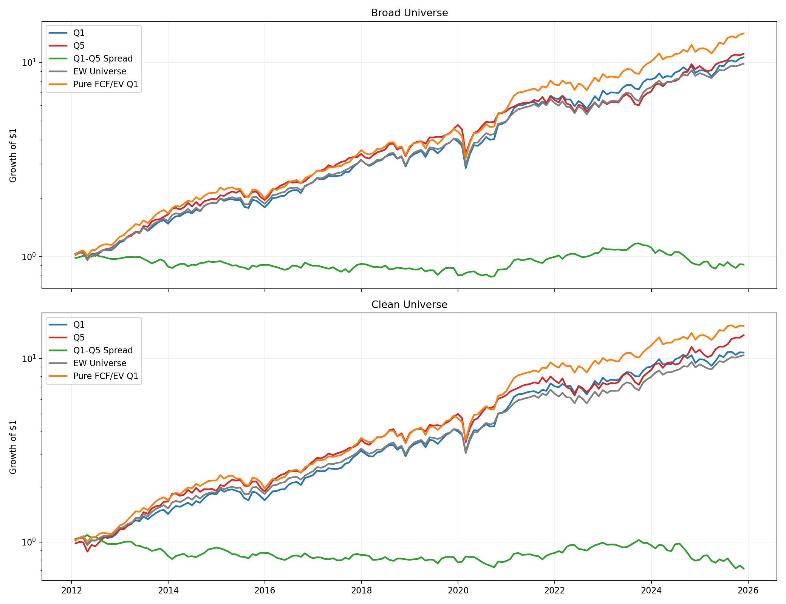

# Parallax

Distilling AI Equity Valuations into Backtestable Signals

## Overview

Parallax asks whether frontier LLM valuations contain a reusable cross-sectional signal. The workflow generates AI-written DCF reports for a contemporary cross-section of US large-cap stocks, converts the model's base-case upside into a ranking target, and trains a parsimonious surrogate using only features that can be reconstructed from EDGAR and market data available at each rebalance date. That surrogate is then frozen and backtested from 2012 through 2025 on monthly point-in-time SEC data. The result is a clean negative finding: the distilled signal fits today's cross-section, but it does not survive historical falsification.

## Research Question

> Do AI-generated DCF valuations contain a cross-sectional signal that is both compressible into accounting ratios and historically portable?

## Answer

No, at least not with GPT-5.4 Nano and public data. The distilled signal does not outperform a simple `fcf_to_ev` value sort over 2012-2025 in either the broad or clean universe. The nonlinearity captured by the frozen surrogate in the present-day cross-section does not survive historical backtesting.

## Pipeline Overview

- `openrouter.py`: calls the GPT-5.4 family through OpenRouter, rate-limits requests, heals malformed cheap-tier JSON, runs validation plus DCF, and writes research reports.
- `parser.py`: normalizes raw research JSON into a structured valuation input with defaults, schema checks, and quality flags.
- `dcf.py`: runs the three-scenario FCFF DCF, computes enterprise and equity value, and writes reusable valuation artifacts.
- `edgar.py`: fetches latest annual SEC companyfacts, aligns tags and fallbacks, and computes the current cross-sectional feature set.
- `historical.py`: builds point-in-time filing snapshots and reconstructs monthly historical feature matrices from accepted SEC filings.
- `distill.py`: matches AI labels to EDGAR features, compares Elastic Net, XGBoost regressor, and XGBoost ranker, and saves plots plus model metadata.
- `stability.py`: runs repeated-CV and bootstrap diagnostics for the frozen-feature workflow and writes supporting stability artifacts.
- `backtest.py`: scores the historical feature matrix with the frozen surrogate, forms monthly portfolios with T+1 execution, and compares results with simple baselines.

## Key Results



- Broad universe: the surrogate `Q1-Q5` spread was positive in 7 of 14 calendar years and delivered `-0.7%` annualized return.
- Clean universe: the surrogate `Q1-Q5` spread was positive in 5 of 14 calendar years and delivered `-2.4%` annualized return.
- Pure `FCF/EV` `Q1` beat surrogate `Q1` in both universes: `20.9%` vs `18.5%` annualized in broad, and `21.5%` vs `18.6%` in clean.
- The frozen XGBoost regressor fits the current matched sample well enough to look interesting ex ante, but that present-day fit does not translate into a robust historical long-short signal.

## Methodology Highlights

- Point-in-time filing discipline: historical features are built from filings accepted before the rebalance date, not from fiscal period ends.
- T+1 execution: portfolio returns use the first available price after the rebalance date.
- Frozen model and feature spec: the primary backtest uses the pre-registered five-feature XGBoost regressor documented in [docs/model_freeze.md](docs/model_freeze.md).
- Honest benchmarking: the surrogate is compared with equal-weight, the opposite quintile, a pure `FCF/EV` value sort, and an additive composite of the same five features.
- Two universes: `clean` requires all five features to be present; `broad` allows up to two missing features and relies on XGBoost's native missing-value handling.

## Limitations

- The historical universe is survivor-biased because it starts from a current S&P 500 ex-Financials ex-REITs list in [tickers.txt](tickers.txt).
- The AI labels come from a single modern cross-section rather than repeated label vintages through time.
- The primary labeling model is the cheapest GPT-5.4 Nano tier, not the stronger full model.
- There are no delisted stocks or CRSP-style return histories.
- Nano collection was operationally noisy: the preserved 100-name batch still ended with 33 failures after one retry, and broader logs imply roughly one-third to two-fifths failure rates depending on the pass.

## What Would Change With Better Resources

- Run the full GPT-5.4 model with `xhigh` reasoning across the entire cross-section, not just as a spot check.
- Replace the survivor-biased public-data setup with a proper point-in-time database that includes delistings, such as CRSP/Compustat.
- Generate multiple AI label vintages over time instead of distilling a single 2026 cross-section backward.
- Use sector-specific surrogate models and feature engineering rather than one pooled specification.

## Setup And Usage

This repo is a research workflow, not a packaged product. Install the dependencies into a virtual environment before running the scripts.

```powershell
python -m venv .venv
.venv\Scripts\Activate.ps1
pip install -r requirements.txt
```

Set the required environment variables:

```powershell
$env:OPENROUTER_API_KEY = "..."
$env:SEC_USER_AGENT_NAME = "Your Name"
$env:SEC_USER_AGENT_EMAIL = "you@example.com"
```

Optional OpenRouter attribution variables are shown in [.env.example](.env.example): `OPENROUTER_TITLE` and `OPENROUTER_REFERER`.

Core commands:

```powershell
# 1. Generate AI DCF reports
python openrouter.py --file tickers.txt --tier cheap --parallel 20

# 2. Pull current EDGAR feature data
python edgar.py --file tickers.txt --output data/edgar_features_full.json

# 3. Distill the AI cross-section into a surrogate
python distill.py --tickers-file tickers.txt --edgar-file data/edgar_features_full.json --reports-dir reports

# 4. Run stability diagnostics / freeze artifacts
python stability.py --tickers-file tickers.txt --edgar-file data/edgar_features_full.json --reports-dir reports

# 5. Backtest the frozen surrogate
python backtest.py --start-year 2012 --end-year 2025 --tickers-file tickers.txt
```

Auxiliary usage:

```powershell
# Re-run the DCF engine on a normalized JSON payload or saved report
python dcf.py reports\AAPL_2026-03-20_cheap.json --output-dir valuations

# Run tests
python -m pytest
```

`parser.py` and `historical.py` are library modules used by the scripts above rather than standalone CLIs.

## Cost

The preserved cheap-tier batch logs in `tmp/` sum to about `$9.66`, so the all-in Nano spend is best thought of as roughly low double digits once exploratory runs are included. The saved full-tier AAPL comparison report in [`reports/AAPL_2026-03-20_full.json`](reports/AAPL_2026-03-20_full.json) records `$1.20` in report metadata. The earlier rough budget in [docs/lessons_learned.md](docs/lessons_learned.md) was about `$0.87` for a full report; realized cost varied with prompt length, output length, and reasoning-token usage.
