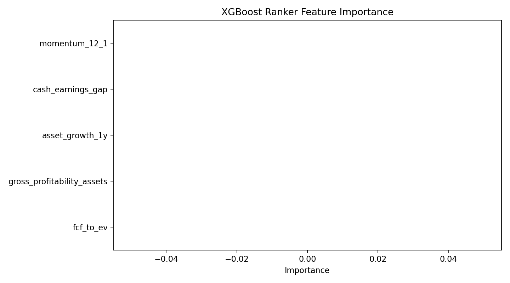
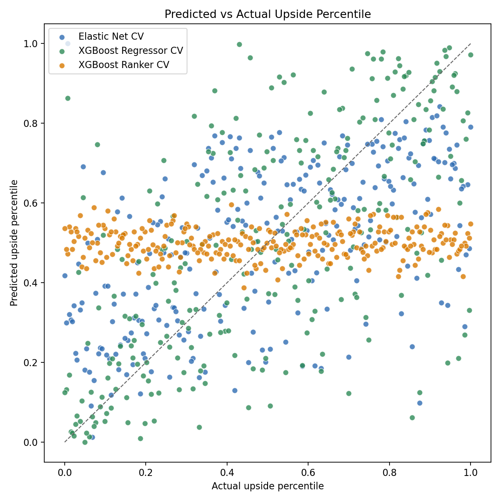
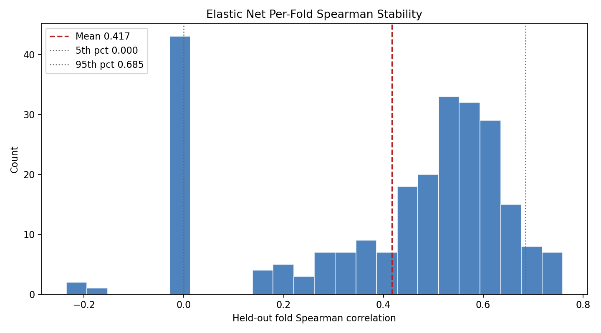
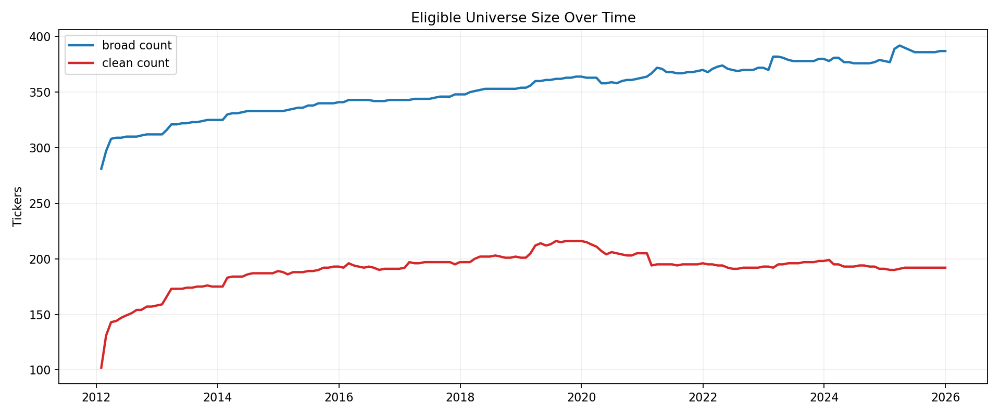

# Parallax Research Note

Distilling AI Equity Valuations into Backtestable Signals

## Abstract

Parallax asks whether AI-generated discounted cash flow valuations contain a cross-sectional signal that can be compressed into a small accounting model and transported backward through history. I generated GPT-5.4 Nano DCF reports for roughly 265 non-financial, non-REIT US large-cap stocks through OpenRouter, converted each base-case upside estimate into a percentile rank, and trained a surrogate on five features reconstructable from EDGAR and market data: `fcf_to_ev`, `gross_profitability_assets`, `asset_growth_1y`, `cash_earnings_gap`, and `momentum_12_1`. After freezing the specification, I rebuilt monthly point-in-time feature matrices from SEC filing acceptance dates and ran 2012-2025 quintile backtests with T+1 execution in both clean and broad universes. The frozen XGBoost regressor fits the present-day cross-section reasonably well, with repeated-CV Spearman around `0.62` and top-quartile stability of `90.8%`. But the historical test is negative: the long-short spread is weak, and a simple `FCF/EV` sort beats the surrogate in both universes. The contribution is methodological rather than promotional: a reusable framework for falsifying AI equity judgments with honest point-in-time data.

## 1. Motivation

Large language models are increasingly used in discretionary equity research. They can summarize filings, reason about business models, and produce valuation narratives that look plausible enough to influence investment decisions. What is still unclear is whether those judgments contain a systematic cross-sectional signal, rather than just persuasive prose.

The main obstacle is historical portability. AI outputs do not come with a 14-year archive of point-in-time recommendations. Even if a modern model can rank today's stocks in a way that appears coherent, direct backtesting is impossible unless the modern judgment can be expressed through variables that did exist historically. That is the core motivation for Parallax. Instead of asking whether an LLM can directly beat the market, the project asks whether the LLM's present-day valuation logic can be distilled into a historically testable surrogate.

That framing matters because it turns a vague "AI for stock picking" question into a falsifiable research design. If the AI's cross-sectional ranking can be compressed into a small set of accounting and price ratios, and if that compressed signal still works when marched backward through point-in-time data, then the model is adding something durable. If it cannot, then the project still yields a useful negative result: the AI may be producing an internally coherent modern cross-section without producing a portable investment signal.

## 2. Approach

The workflow begins with a contemporary cross-section. Using [`openrouter.py`](../openrouter.py), I generated AI DCF reports for a current S&P 500 ex-Financials ex-REITs style universe, using GPT-5.4 Nano through OpenRouter as the primary labeling model. The raw AI JSON was normalized by [`parser.py`](../parser.py), valued by [`dcf.py`](../dcf.py), and stored as report artifacts in `reports/`.

The target for distillation is not the raw intrinsic value itself, but the cross-sectional rank of AI base-case upside. For each stock that passed the data-quality filters, Parallax takes `_valuation.scenarios.base.upside_downside_pct`, then transforms that into a fractional percentile rank from `0.0` to `1.0`. This turns the problem into supervised cross-sectional interpolation: can a small tabular model reproduce the AI's ranking of relative attractiveness?

The surrogate is then frozen and backcast. [`historical.py`](../historical.py) reconstructs monthly point-in-time feature matrices from SEC companyfacts, with filing acceptance dates rather than fiscal period ends governing eligibility. [`backtest.py`](../backtest.py) scores each monthly cross-section with the frozen surrogate, forms quintile portfolios, and measures forward returns from the first available trading day after the rebalance date to the first available trading day after the next rebalance date.

The final frozen research slice contains `264` matched names, documented in [`docs/model_freeze.md`](../docs/model_freeze.md) and [`models/frozen_model_metadata.json`](../models/frozen_model_metadata.json). The historical backtest spans calendar years `2012` through `2025`.

## 3. Feature Selection

The frozen feature set is intentionally small:

- `fcf_to_ev`: a direct value anchor based on free cash flow relative to enterprise value.
- `gross_profitability_assets`: a quality/profitability signal in the spirit of Novy-Marx.
- `asset_growth_1y`: an investment-discipline signal aligned with the Fama-French investment literature and the broader asset-growth anomaly.
- `cash_earnings_gap`: a cash-quality proxy in Sloan's accruals tradition.
- `momentum_12_1`: intermediate-term momentum, excluding the most recent month.

These five survived because they met three constraints at the same time. First, they had clear economic stories. Second, they were reconstructable from annual EDGAR filings plus market data with tolerable coverage. Third, they were simple enough to freeze ex ante without turning the surrogate into an overfit catalog of bespoke ratios.

Coverage on the frozen `n=264` matched sample was strong for four of the five features: `asset_growth_1y`, `cash_earnings_gap`, and `momentum_12_1` were present for all `264` names, while `fcf_to_ev` covered `243` names (`92.0%`) and `gross_profitability_assets` covered `222` names (`84.1%`). That last figure matters because gross-profit-based signals were the sparsest part of the EDGAR extraction pipeline. [`docs/lessons_learned.md`](./lessons_learned.md) explicitly notes weak gross-margin coverage, which is one reason the project favored a compact, missing-tolerant tree model over a larger hand-built linear recipe.

What was dropped? Earlier artifacts show a much wider candidate menu, including raw size variables, margin ratios, balance-sheet ratios, turnover, accruals, and other derived quantities. Those were not retained in the frozen spec because the project shifted from "include everything that seems predictive today" toward "keep only features that are economically legible, point-in-time reconstructable, and robust enough to backcast honestly." Some candidates were redundant with the final five. Others were too brittle because they depended on noisy share-count paths, sparse gross-profit extraction, or overlapping market-value inputs. The result is not the statistically maximal feature set. It is the smallest defensible one.

*Saved XGBoost diagnostic feature-importance plot from the distillation pass. The frozen XGBoost regressor metadata shows the same first-order takeaway: `fcf_to_ev` dominates, with `momentum_12_1` and `asset_growth_1y` secondary.*

## 4. Model Selection

Parallax compared three surrogate classes:

- Elastic Net, as the transparent linear baseline.
- XGBoost regressor, as a nonlinear model for the percentile-ranked target.
- XGBoost ranker, as a direct ranking formulation.

The ranker was the easy call to reject. On the local stack and data slice preserved in the repo, it degenerated into near-constant scores and effectively ignored the five features. That is visible both in the logs and in the metadata, where the ranker produces zero feature importance and near-zero repeated-CV Spearman.

The harder question was Elastic Net versus XGBoost regressor. On the earlier `n=66` baseline preserved in `tmp/distill_baseline_n66.json`, the project still treated Elastic Net as the preferred model. The margins were small, the linear model looked easier to explain, and the intermediate CLI verdict still printed "Elastic Net wins." That small-sample result is real and worth preserving, because it shows how easy it is to over-read a neat linear story from a narrow matched set.

By the frozen `n=264` sample, that ambiguity disappeared. The XGBoost regressor achieved mean repeated-CV Spearman of about `0.620`, versus `0.417` for Elastic Net, while the ranker remained unusable. In other words, once the data set expanded, the AI label looked less like a mostly linear combination of simple value and quality factors, and more like a modest nonlinear surface with interactions and missing-value splits. That does not prove the AI contains deep proprietary insight. It does suggest that the AI's present-day cross-sectional logic is not fully reducible to a sparse linear model.

*Predicted versus actual AI upside percentile across the three candidate models. The XGBoost regressor is the tightest cloud; the ranker collapses.*

## 5. Stability Analysis

The frozen model decision rests on stability, not just one cross-validation mean. The project used repeated 5-fold CV, bootstrap out-of-bag intervals, and top-quartile consistency. On the frozen `n=264` sample, the XGBoost regressor delivered:

- Repeated-CV Spearman mean: `0.6196`
- Repeated-CV 5th to 95th percentile range: `0.4577` to `0.7448`
- Bootstrap CI: `0.4959` to `0.7193`
- Top-quartile stability: `90.8%`

Those are good enough to justify a historical falsification test. They are not good enough to claim that the surrogate has discovered a durable alpha source. The important distinction is that Parallax froze the model because it looked stable in the current cross-section, then asked whether that stability represented real transportable structure or just a local fit to one label vintage.

The linear baseline became much less convincing once the sample scaled. Its repeated-CV Spearman fell to `0.417`, its 5th percentile touched `0.000`, and its bootstrap interval reached zero. That degradation is informative. It says the earlier linear story was probably too optimistic, and it also explains why the project's final interpretation focuses on nonlinear present-day fit rather than a sparse linear factor clone.

The repo's retained Spearman histogram is from that intermediate Elastic Net stability pass rather than from the frozen XGBoost regressor. I include it because it is part of the documented model-selection path, while the frozen regressor stability numbers are recorded directly in metadata rather than as a separate histogram artifact.

*Elastic Net per-fold Spearman stability from the intermediate freeze workflow. The frozen XGBoost regressor stability numbers are reported in `models/frozen_model_metadata.json`.*

## 6. Backtest Design

The backtest is intentionally conservative about information timing. A historical feature vector is eligible only if the relevant annual filing was accepted by the SEC before the rebalance date. This is the critical point-in-time rule: no peeking at later filings, and no pretending that fiscal year-end information was tradable before it was actually filed.

Execution is T+1. The entry price is the first available price after the rebalance date, and the exit price is the first available price after the next rebalance date. Rebalancing is monthly.

Two universes are tested:

- `clean`: all five frozen features must be present.
- `broad`: up to two frozen features may be missing, with XGBoost handling missing values natively.

The benchmark set is also explicit:

- Equal-weight universe return.
- Model `Q5`, to check whether the model's top bucket actually beats its own bottom bucket.
- Pure `FCF/EV` quintile sort.
- Additive linear composite of the same five features.

This matters because a negative result against naive benchmarks is more credible than a negative result against nothing. If the distilled AI signal cannot beat a direct value sort or even a simple additive composite of the same ingredients, then the burden shifts away from "maybe the benchmark was too weak" and toward "the signal itself was not portable."

*Eligible universe size over time. The broad universe ranged from `281` to `392` names; the clean universe ranged from `102` to `216`.*

## 7. Results

The historical result is negative. The surrogate does not produce a durable long-short spread over `2012-2025`, and it does not beat pure `FCF/EV` on the long side.

In the broad universe:

- Model `Q1` annualized return: `18.5%`
- Model `Q1-Q5` spread annualized return: `-0.7%`
- Spread positive years: `7/14`
- Pure `FCF/EV` `Q1` annualized return: `20.9%`

In the clean universe:

- Model `Q1` annualized return: `18.6%`
- Model `Q1-Q5` spread annualized return: `-2.4%`
- Spread positive years: `5/14`
- Pure `FCF/EV` `Q1` annualized return: `21.5%`

The clean-universe result is particularly important because it removes the obvious objection that missing data or imputation drove the failure. It did not. Even where the accounting signal is fully observed, the model does not show historically portable spread behavior.

There is also a subtler result. The additive composite of the same five features outperformed model `Q1` in both universes. That means the nonlinear present-day fit was not the main missing ingredient. Whatever extra structure the surrogate learned in the 2026 cross-section did not survive contact with 14 years of historical data.

*Cumulative returns for the backtest portfolios. The pure `FCF/EV` long-only sort is consistently harder to beat than the distilled AI signal.*

## 8. Interpretation

There are at least three plausible explanations for the negative result.

First, Nano quality may simply be too low. The repo's operational notes show that cheap-tier runs were fragile, with malformed or incomplete responses occurring often enough to matter. A model that fails structurally on a meaningful share of names may still produce enough cross-sectional variation to fit today, but not enough semantic quality to yield a durable valuation signal.

Second, the distillation step may lose something essential. It is possible that the AI is using information not captured by the five frozen features, or that its useful judgment lives in interactions that the surrogate only approximates locally. In that case the current cross-sectional fit is real, but the compression is too lossy.

Third, stationarity may fail. Even if the AI ranking and the surrogate fit are both internally coherent today, the relationship may not map backward through time. The model might be picking up a 2026-specific valuation regime, current narratives, or modern capital-market structures that did not operate the same way in 2012.

The key point is that these explanations cannot be cleanly separated with the present data. That is why the honest conclusion is negative but conditional: the design worked, the specific signal did not.

## 9. What I Would Do Next

- Re-run the full cross-section with the full GPT-5.4 model using `xhigh` reasoning instead of Nano.
- Replace the survivor-biased public-data history with a proper point-in-time database that includes delisted names.
- Generate multiple label vintages through time rather than distilling one modern cross-section backward.
- Split the surrogate by sector or industry so the model is not forced to learn one pooled valuation surface for utilities, cyclicals, software, and staples at once.
- Revisit feature engineering with sector-aware versions of value, quality, and reinvestment measures.

These are not cosmetic upgrades. Each one addresses a different failure mode in the current design: label quality, historical coverage, temporal mismatch, and cross-sector heterogeneity.

## 10. Conclusion

Parallax is best read as a methodology paper with a negative empirical result. The pipeline is careful about information timing, explicit about benchmarks, disciplined about freezing the model after the modern cross-section, and honest about the limits of public-data backtesting. That is the main strength of the project.

The specific answer to the research question is no. In this implementation, AI-generated DCF valuations can be compressed well enough to fit a current cross-section, but that compressed signal does not travel backward through history in a way that beats a simple `FCF/EV` value sort. The nonlinear structure learned by the surrogate looks real in sample and non-portable out of sample.

That is still a useful result. It suggests that the right way to evaluate AI judgment in equity research is not to admire contemporary outputs, but to force them into point-in-time, benchmarked, historically falsifiable tests. Parallax provides a production-like prototype for doing exactly that.
